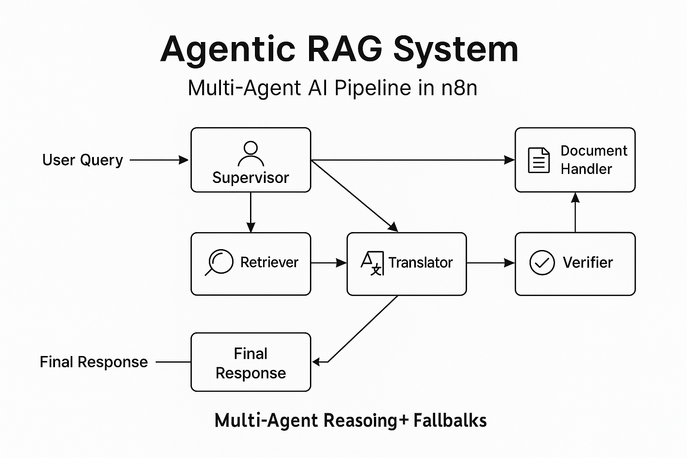

# Agentic RAG System: Multi-Agent Retrieval and Reasoning Workflow with n8n

> **Project Pitch:**  
> I built an agentic RAG system that doesn't just retrieve information — it thinks, reasons, and double-checks like a smart research assistant.  
> It breaks user questions into parts, routes each part to the right domain expert agent, uses business glossaries and metadata, and combines the outputs into high-quality, verified answers.  
> It even asks itself follow-up questions if needed to ensure the user always receives a precise, domain-aware response.

---

## 📊 System Diagram

This workflow uses intelligent agent routing and fallback mechanisms:

---

## What It Does
- Breaks complex questions into smaller sub-questions
- Routes each sub-question to the best domain expert agent using metadata and glossaries
- Pulls from multiple retrieval sources (knowledge bases, vector stores)
- Synthesizes final answers, checking consistency and completeness
- Uses a Supervisor Agent to manage the conversation intelligently and autonomously

---

## Technologies Used
- n8n (workflow orchestration)
- OpenAI GPT models via LangChain
- Vector search with Pinecone or Weaviate
- Metadata filtering and glossary matching
- Agentic orchestration strategies (Supervisor Agent, Specialist Agents, Follow-up Question Generation)

---

## Files
- **agentic-rag-system-workflow.json** — The exported n8n workflow file
- **agentic-rag-system-diagram.png** — Visual flow diagram of the system

---

## Why This Matters
This project shows how modern AI systems can go beyond simple question answering — building agentic, multi-step, self-verifying reasoning flows that ensure higher quality, domain-specific answers.  
It demonstrates practical AI orchestration skills with real business impact potential.

---

## Future Work

- Implement a dynamic Supervisor Agent that adapts its aggregation logic based on domain-specific metadata
- Integrate document freshness scoring to prioritize recent information retrieval
- Add an automated retraining system to update the domain experts based on new data
- Deploy a monitoring dashboard to track agent performance, answer latency, and user satisfaction
- Build an agent evaluation dashboard for performance benchmarking

---
*Demo built for AI Agent Implementation Manager portfolio presentation.*
